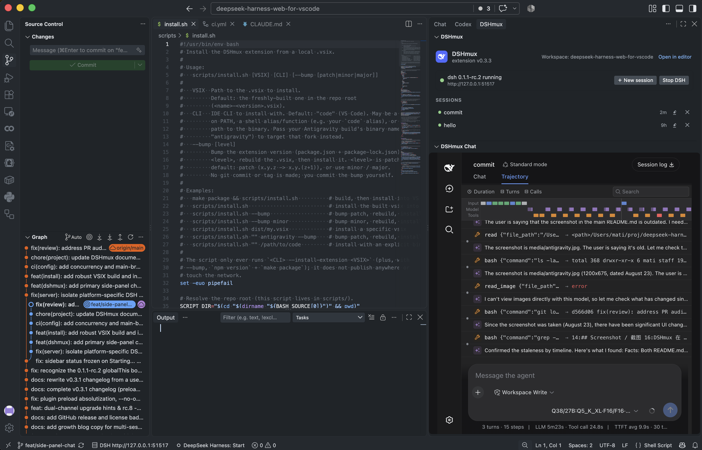

# DSHmux

**English** | [中文](README.zh.md)

[](LICENSE)
[](https://github.com/matik5/DSHmux/actions)
[](https://github.com/matik5/DSHmux/releases/latest)
[](https://open-vsx.org/extension/matik5/dshmux)
[](https://marketplace.visualstudio.com/items?itemName=matik5.dshmux)
[](https://open-vsx.org/extension/matik5/dshmux)

**DSHmux** launches DeepSeek Harness and embeds its full Web UI inside VS Code (and Antigravity), so DSH agents and your editor share one window and the same state as the browser UI.

## Screenshot / 截图



## Features

- **Stay in your editor** — use DeepSeek Harness and write code in the same window, in **VS Code or Antigravity**; no more switching between the IDE and a browser tab to watch the Agent work.
- **One of your Agent stack** — VS Code / Antigravity let you install multiple coding-agent extensions, each powered by its own LLM (e.g. Claude Code, ChatGPT, …), and this extension is one of them: a DeepSeek Harness Agent that works side by side with the others. Run several Agents on the same task at the same time to cross-review answers and cover each model's blind spots.
- **One-click start / stop** — the extension manages a `dsh web` child process with an OS-assigned port. Entry points: activity-bar icon (sidebar launcher) or Command Palette.
- **Side-panel chat** — the full DSH frontend is the primary chat surface beneath the compact launcher and session list.
- **Optional editor view** — use **Open in editor** when a conversation needs more space.
- **Works with the browser instance** — uses your `~/.dsh` by default, so sessions and settings are shared with the browser UI.
- **Current folder as workspace** — the DSH default project directory is the folder you have open.
- **Workspace alignment** — the DSH workspace anchor follows your IDE workspace, and the embedded UI selects the current folder rather than the most recently active one.
- **Remote windows** — works in Remote SSH, WSL, and dev containers: DSHmux runs on the workspace host and maps DSH's loopback port into the webview, so the embedded UI reaches the remote DSH process.
- **Session manager** — the sidebar lists active sessions with title and relative activity time, supports inline rename/archive, and switches the single primary chat view between sessions.
- **Auto-start from the icon** — clicking the activity-bar icon starts dsh for you when it is not running.
- **dsh version check + easy upgrade** — the launcher shows "Update available: x.y.z →" when a newer dsh exists; one click offers the right upgrade command for your install method (npx / npm global / nvm) prefilled into a terminal (24h check gate, offline-safe).
- **Clipboard works** — copy/paste in the embedded UI goes through a transport bridge (VS Code webviews block clipboard inside iframes; the bridge routes it via `vscode.env.clipboard`).
- **Event sounds** — distinct Web Audio cues announce task start, task completion, and requests for user input (`dshmux.completionSound`, default `true`).
- **Compact side-panel typography** — the sidebar frame is zoomed to 90% by default (`dshmux.frameFontScale`, range 0.5–1.5); the editor-tab view keeps the upstream size.
- **Theme follows VS Code** — the embedded UI follows your editor color theme (dark/light), live on switch (`dshmux.themeSync`, default `follow`).
- **Cross-platform** — macOS, Linux and Windows, verified end-to-end by CI (unit tests + a real `dsh` spawn smoke test on all three).
- **Multilingual UI** — the extension chrome (launcher, overlay, commands) follows your VS Code language across 9 locales: English, 中文, 日本語, 한국어, Русский, Español, Português, Français, Deutsch.
- **Security first** — the server binds loopback only; the extension relays requests as plain Node requests, never weakening DSH's `/api` trust fence. (Note: the embedded page and its plugins are trusted — clipboard read/write is bridged to the system clipboard without a browser permission prompt, the same trust you grant the extension itself.)

## Requirements

- [DeepSeek Harness](https://github.com/deepseek-ai/deepseek-harness) installed: `npm i -g @deepseek-ai/dsh` (in Remote SSH/WSL/container windows, on the remote host)
- VS Code ≥ 1.90 (the extension also works in Antigravity via Open VSX)

## Install

- **VS Code**: [Visual Studio Marketplace](https://marketplace.visualstudio.com/) → search *DSHmux*
- **Antigravity / Open VSX**: [Open VSX](https://open-vsx.org/) → search *DSHmux*

## Usage

1. Click the **DSHmux** icon in the activity bar. DSH starts automatically when needed.
2. Chat in the side panel, select or create sessions from the launcher, and use **Open in editor** for a larger view.
3. Use **Stop DSH**, **Open in Browser**, or an update notice when needed.

To make DSH use your project as its default workspace, open that folder in the window first.

## Configuration

| Setting | Default | Description |
|---|---|---|
| `dshmux.dshPath` | empty | Absolute path to DSH on the host where this VS Code window's workspace extension runs. In Remote SSH/WSL/container windows, set it under **Remote Settings**. An unavailable path is ignored and DSH is discovered on that host. For a source checkout, point to its built `apps/cli/lib/bin.js`; Node.js must be installed on that host. Restart DSH after changing it. |
| `dshmux.themeSync` | `follow` | Follow the VS Code color theme into the embedded DSH UI; `off` leaves DSH's own appearance untouched. |
| `dshmux.completionSound` | `true` | Play sounds for task start, completion, and user-input requests. |
| `dshmux.frameFontScale` | `0.9` | Zoom for the embedded DSH UI content (1 = default size); lower values make the interface more compact. Range 0.5–1.5. |

## Development

```sh
npm install --cache .npm-cache
npm run compile     # tsc
npm test            # node:test unit tests
npm run package     # vsce package -> vsix
```

Press `F5` in VS Code to launch the Extension Development Host.

## Architecture

The extension spawns `dsh web --port 0`, serves the DSH frontend as same-origin webview resources, and relays `fetch` / WebSocket / clipboard through a `postMessage` bridge to the extension host, which performs the real calls as plain Node requests (passing DSH's `/api` trust fence). Design and verification notes:

- Architecture proposal: [`doc/architecture/proposal-by-deepseek.md`](doc/architecture/proposal-by-deepseek.md)
- Feature pipeline: [`doc/feature/00-dsh-vscode/`](doc/feature/00-dsh-vscode/)

## Changelog

See [CHANGELOG.md](CHANGELOG.md) / [CHANGELOG.zh.md](CHANGELOG.zh.md).
## License

MIT — see [LICENSE](LICENSE). Copyright © 2026 Liming Xie, Mati Kosemäe.
